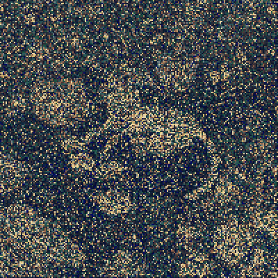
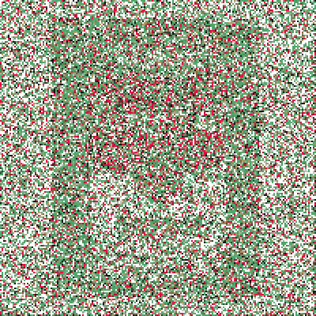
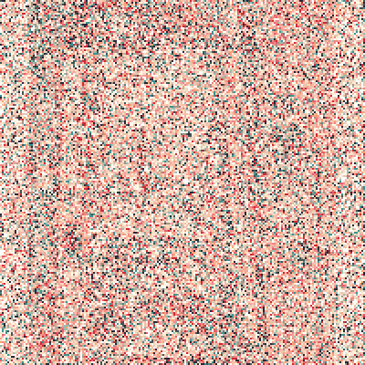

# Generating images with genetic algorithm

This is the university project for image generation via genetic algorithm.

## What is a genetic algorithm

It is the algorithm that exploitates the idea of that after a huge amount of generations any organism is becoming the perfect version of itself. That is, firstly we have one intial generation. It creates descendents via mutations and crossingovers (combinations of genes of different organisms), and then happens the "survival of the fittest" in order not to let the weak organisms to ruin everything. Thus, at the end we remain with a one perfect generation.

## Idea

Basically, this is a simple one. The algorithm takes an image as an input and retrieves the palette from it. Them, it generates the whole generation of images consisting of squares of random colours from this palette. Then, this generation passes throught the whole life of mutations, extinctions and new generations, when at the end it converges to the input image.

## Results

Here are some processes for images creation:

